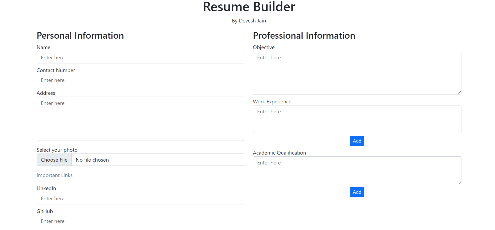

# 📃 Resume Builder

* A modern dynamic Resume Builder created  using HTML and JavaScript which is used for returning the Resume Template where the details are sent using API. 

* Demo link: https://proud-rock-064b1f610.azurestaticapps.net/

* User can enter their details including the professional links(LinkedIn, GitHub, Code Chef) along with their work experience and academic qualification which would generate a neatly formatted resume that could further be downloaded or printed.

---
 

## 👇 Download Files
* Go to my GitHub repository: https://github.com/dudenayak/Resume-Builder
* Download Zip or clone repo

* Then open the folder in your IDE 

## 😻 Run Resume Builder

Open index.html file and test it. 🎉

---

